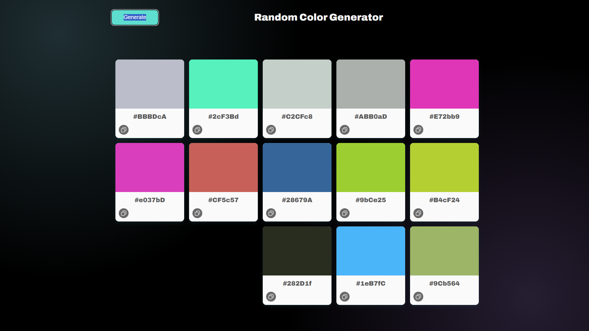

# Color Palette Generator

A modern and responsive Color Palette Generator built with HTML, CSS, and JavaScript.

---

## Technologies Used

---

## ✨ Features

- Generate random color palettes
- Display HEX color codes
- Copy color codes to clipboard
- Clean and modern user interface
- Responsive design

---

## 📸 Preview

